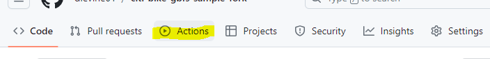

Use this repo to get data from Citi Bike's GBFS real-time data feed and revisit the analysis we used for [*Riding Forward:Overhauling Citi Bike’s Contract for Better, More Equitable Service*](https://comptroller.nyc.gov/reports/riding-forward-overhauling-citi-bikes-contract-for-better-more-equitable-service/)

### 1. Fork this repo

1. Click 'Fork' above 


1. optionally, give it a new name

2. Click 'Create fork'

### 2. Start recording data

The GitHub Action will fetch and save the GBFS data on the specified schedule. The schedule or frequency is set with [crontab](https://crontab.guru/) syntax. E.g., to fetch data each hour at 10 minutes after the hour, use `10 * * * *`

1. set schedule to get data:
 
- Navigate to [/.github/workflows/pull-data.yaml](/.github/workflows/pull-data.yaml) and edit line 4 to specify the frequency to fetch the data. 

- replace `delete` with e.g.
    ```yaml
    schedule:
    - cron: '10,25,40,55 * * * *'
    ```
    (or whatever frequency/schedule you like)

- Commit the change (and push to GitHub if necessary).

2. enable Actions

- Click the 'Action' tab


- Click <kbd>I understand my workflows, go ahead and enable them</kbd> to enable workflows from the forked repo

- on the left, under 'Workflows' click 'pull full data w python'

- Click <kbd>Enable workflow</kbd> to enable the workflow

Now data will be saved in the GitHub repo at [`/data`](/data) and successful data flow runs will be logged on this page.

### 3. Build a dataset

After you have recorded some data:

Pull the data from GitHub to your local instance.

Then use the Jupyter notebook [`Build dataset`](Build%20dataset.ipynb). This will combine the data snapshots into a single dataset, indexed by data timestamp and `station_id`, and a companion geojson of station locations indexed by `station_id`

### Example notebooks

Sample notebooks show the code we used for pieces of this analysis.

1. [Build service measures](Examples/Build%20service%20measures.ipynb) creates the measures of poor service which we used, including frequency and duration stations had no bikes or no docks, and portion of docks which had broken bikes. 
2. [Compute clusters of poor service](Examples/compute%20clusters%20of%20poor%20service.ipynb) identifies significant clusters of poor service across each of these service measures, using local indicators of spatial association.
3. [Get Census data](Examples/Get%20Census%20data.ipynb) and [Compare demographics](Examples/Compare%20demographics.ipynb) load Census geometry and counts through APIs, join Tracts with the Citi Bike service area and clusters of poor service, and aggregates and visualizes the comparison demographics.
4. [Count violations of rebalancing standards](Examples/Count%20violations%20of%20rebalancing%20standards.ipynb) estimates the instances and total fine amount for Citi Bike's failure to meet its rebalancing standards requiring stations not remain empty of full.


### Python environment

You can [create a conda environment](https://conda.io/projects/conda/en/latest/user-guide/tasks/manage-environments.html#creating-an-environment-from-an-environment-yml-file) using the [`citibike-analysis-environment.yml`](citibike-analysis-environment.yml) to load the Python packages needed to run these notebooks. 
